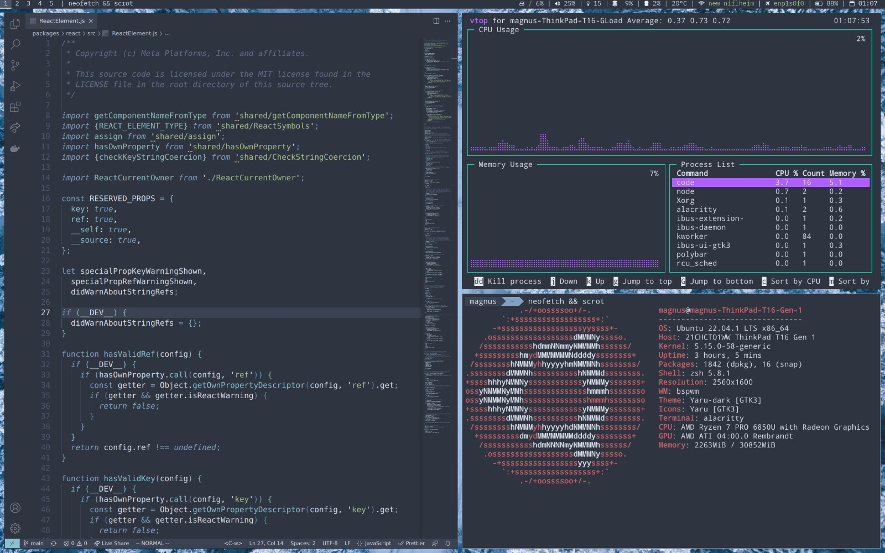

# Dotfiles

**Dotfiles** help me keep my configuration files in one place, so if I change hardware, my config stays same.
Note that these configurations and checklist are for Ubuntu.

Current setup:

purpose|tool
-----|-----
OS|Ubuntu 22.04.1 LTS
shell|zsh with oh-my-zsh
WM|bspwm
bar|polybar
launcher|rofi
notifications|dunst
terminal|alacritty
editor|vscode

## To Do

- check out hyprland
- use GNU Stow

## Checklist

### 1. Local setup

- Clone this repository to `~/dotfiles`
- Install these tools:
  - zsh, git, bspwm, feh, scrot, rofi, dunst, polybar (`sudo apt-get install zsh git-core scrot rofi dunst bspwm polybar`)
- Install [oh-my-zsh](https://github.com/ohmyzsh/ohmyzsh) (`sh -c "$(curl -fsSL https://raw.githubusercontent.com/ohmyzsh/ohmyzsh/master/tools/install.sh)"`)
- Install [Powerline Compatible Fonts](https://github.com/powerline/fonts) as well as [Dank Mono](https://dank.sh/)

### 2. Secure Git(Hub) access

- [Generate new SSH key](https://help.github.com/articles/generating-ssh-keys/)
- [Generate an access token](https://help.github.com/articles/creating-an-access-token-for-command-line-use/) for Terminal to auth your GitHub account when 2FA is enabled

### 3. Setup vscode

- extensions and settings are synced via github account

### 4. Useful snippets

- you can use `feh --bg-scale ~/papes/(ls ~/papes | shuf -n 1)` to set a random wallpaper from the papes folder

### 5. Install and use it yourself

- `./install.sh` should do the job. vscode, fish, i3 and tmuxinator files are symlinked, the rest is just copied **and will delete existing files**.
- Fork this repo, or just copy-paste things you need, and make it your own. **Please be sure to change your `.gitconfig` name and email address though!**
